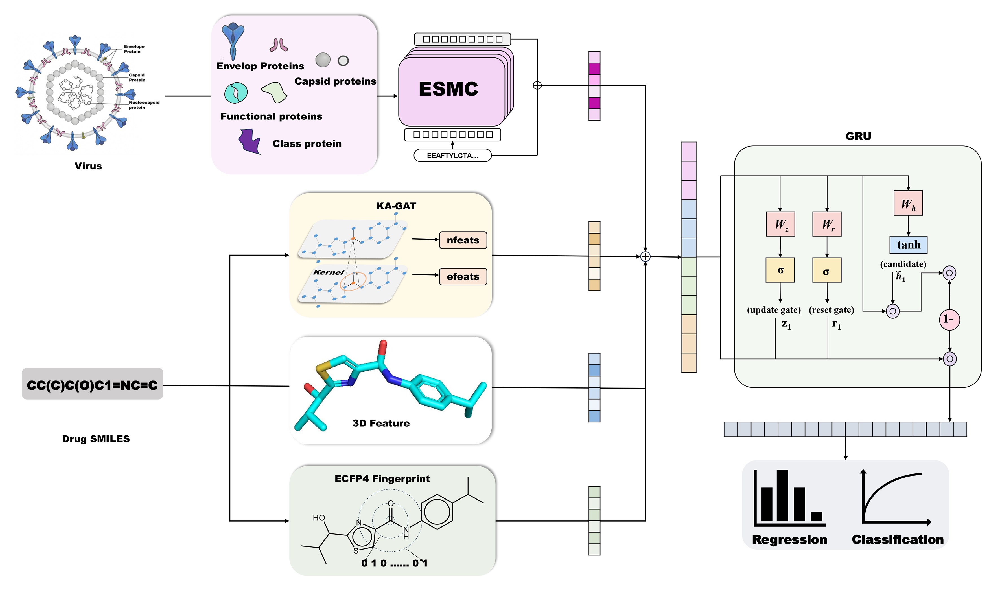

# DeepMolVir

**A Multi-modal Deep Learning Framework with Virus Protein Language Representations for Virus-Inhibitor Activity Prediction**



This repository implements the **V+E+G+U** model (**V**irus embedding + **E**CFP fingerprint + **G**raph (KA-GAT) + **U**niMol representation) for two prediction tasks:

- **Binary classification** – active (IC₅₀ ≤ 5000 nM) vs. inactive (IC₅₀ > 5000 nM)
- **Regression** – direct prediction of pIC₅₀ = 9 – log₁₀(IC₅₀ in nM)

The model uses a 5‑fold cross‑validation scheme with a held‑out test set. Both tasks share the same multi‑modal architecture and data preparation pipeline.

---

## Table of Contents

- [Data Preparation](#data-preparation)
- [Installation](#installation)
- [Preprocessing for New Molecules](#preprocessing-for-new-molecules)
- [Running Prediction](#running-prediction)

---

## Data Preparation

1. Place the required files into the `data/` folder:
   - `Database_smiles.xlsx` — must contain columns: `Smiles`, `vVirus name`, `nM-value`
   - `virus_three_embeddings_esmc600m.npz` — virus protein embeddings from ESMC‑600M
   - `unimol_cls_repr.npy` — UniMol CLS representations for all molecules (N×512)

2. Pre‑split indices (`.npy` files) must be placed inside `data/splits/`:
   - `test_indices.npy`
   - `train_indices_fold_0.npy` … `train_indices_fold_4.npy`
   - `val_indices_fold_0.npy` … `val_indices_fold_4.npy`

These splits are used for training and cross‑validation. **For prediction on new molecules, you do not need these split files.**

---

## Installation

It is recommended to use a conda environment for RDKit, but pip works as well. Install the required packages:

```bash
pip install -r requirements.txt
```

If you prefer conda, create an environment with:

```bash
conda create -n deepmolvir python=3.10
conda activate deepmolvir
conda install -c conda-forge rdkit=2023.09.6
pip install -r requirements.txt   (excluding rdkit-pypi)
```

`requirements.txt` contains (versions compatible with the tested environment):

```
torch==2.4.0
dgl==2.4.0
scikit-learn==1.4.2
matplotlib==3.5.3
pandas==2.1.4
numpy==1.26.4
rdkit-pypi
tqdm
scipy==1.9.0
pyyaml==6.0
```

---

### Download Pre‑computed Files (Zenodo)

The following large files are hosted on Zenodo. Download them and place them in the appropriate directories.

| Task | File(s) | Destination | Zenodo Link |
|------|---------|-------------|--------------|
| Classification | `unimol_cls_repr.npy` | `data/` | [Download](https://doi.org/10.5281/zenodo.xxxxxxx) |
| Classification | `classifier_fold_0.pt` … `classifier_fold_4.pt` | `models/V+E+G+U/classifier/` | [Download](https://doi.org/10.5281/zenodo.xxxxxxx) |
| Regression | `regressor_fold_0.pt` … `regressor_fold_4.pt` | `models/V+E+G+U/regressor/` | [Download](https://doi.org/10.5281/zenodo.xxxxxxx) |

*Replace the Zenodo DOI with the actual repository DOI.*

---

## Preprocessing for New Molecules

When you have a new set of molecules (e.g., `data/molecules.csv` with a `SMILES` column), you must regenerate three molecule‑dependent files before running prediction. **The order of rows in these files must exactly match the order in your input CSV.**

| File | Description |
|------|-------------|
| `data/graphs.bin` | DGL molecular graphs (node/edge features) |
| `data/unimol_cls_repr.npy` | UniMol CLS embeddings (N×512) |
| `data/ecfp4_2048.npy` | ECFP4 fingerprints, radius 2, 2048 bits (N×2048) |

The pre‑trained models (`models/V+E+G+U/classifier/` or `models/V+E+G+U/regressor/`) and virus embeddings (`data/virus_three_embeddings_esmc600m.npz`) are fixed and do not need to be recomputed.

To generate these three files, use a preprocessing script (not provided in this repository) that reads the SMILES list and computes:

- ECFP4 fingerprints via RDKit’s `GetMorganFingerprintAsBitVect`
- UniMol CLS vectors using a loaded UniMol encoder (must match training)
- DGL graphs using the `smiles_to_graph` function defined in `src/predict.py`

---

## Running Prediction

Once the three precomputed files are ready, run the prediction using the **ensemble of 5 models**. Choose the task (classification or regression) accordingly.

### Binary Classification (Active vs. Inactive)

```bash
python src/predict_classifier.py \
    --smiles_csv data/molecules.csv \
    --virus_name "Enterovirus a71" \
    --model_dir models/V+E+G+U/classifier \
    --virus_npz data/virus_three_embeddings_esmc600m.npz \
    --graph_file data/graphs.bin \
    --unimol_npy data/unimol_cls_repr.npy \
    --ecfp_npy data/ecfp4_2048.npy \
    --output_csv top50000_classifier.csv \
    --top_k 50000 \
    --batch_size 128
```

### Regression (pIC₅₀ Prediction)

```bash
python src/predict_regressor.py \
    --smiles_csv data/molecules.csv \
    --virus_name "Enterovirus a71" \
    --model_dir models/V+E+G+U/regressor \
    --virus_npz data/virus_three_embeddings_esmc600m.npz \
    --graph_file data/graphs.bin \
    --unimol_npy data/unimol_cls_repr.npy \
    --ecfp_npy data/ecfp4_2048.npy \
    --output_csv top50000_regressor.csv \
    --top_k 50000 \
    --batch_size 128
```

**Arguments explained:**

| Argument | Description |
|----------|-------------|
| `--smiles_csv` | CSV file containing the molecules (must have a `SMILES` column) |
| `--virus_name` | Name of the virus as it appears in the virus embedding file |
| `--model_dir` | Directory with `fold_0.pt` … `fold_4.pt` (task‑specific) |
| `--virus_npz` | Path to the virus embedding file |
| `--graph_file` | Precomputed DGL graphs (`.bin`) |
| `--unimol_npy` | Precomputed UniMol features |
| `--ecfp_npy` | Precomputed ECFP4 fingerprints |
| `--output_csv` | Output file name for top predictions |
| `--top_k` | Number of top scoring molecules to keep (classification: by probability; regression: by highest pIC₅₀) |
| `--batch_size` | Batch size for inference (adjust for GPU memory) |

Use `--device cuda` or `--device cpu` to force a specific device; by default, CUDA is used if available.

---

**If you use DeepMolVir in your research, please cite:**  
*(citation information will be added upon publication:DeepMolVir: Learning Virtual Virus Representations for Sequence-Aware Virus-Inhibitor Activity Prediction)*
